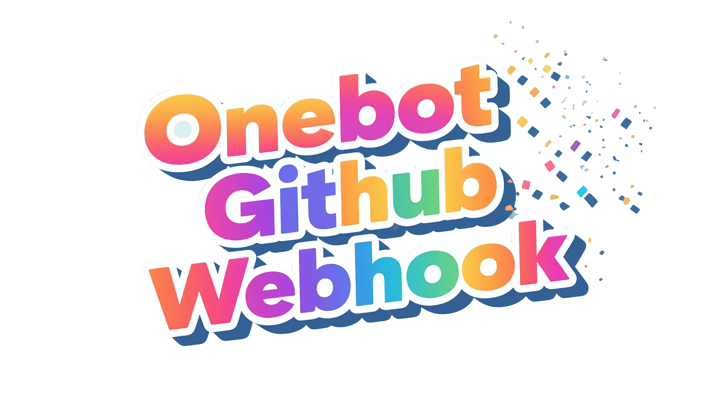

<h1 align="center">
  OneBot GitHub Webhook
</h1>

  

# OneBot GitHub Webhook

OneBot GitHub Webhook 是一个用于接收 GitHub Webhook 推送事件并通过 OneBot 协议将通知转发到 QQ 群/好友的轻量级服务。它允许开发者和团队实时跟踪 GitHub 仓库活动，提高协作效率和项目透明度。

## 功能特点

### 现有功能

- **Webhook 事件接收**：接收并处理 GitHub 的 Webhook 推送事件
- **安全验证**：支持 Webhook 签名验证，确保请求安全性
- **OneBot 协议支持**：通过 OneBot 协议将推送信息转发到指定的 QQ 群或私聊
- **灵活配置**：可配置监听的仓库、分支和事件类型
- **高级匹配规则**：
  - **仓库匹配**：支持通配符模式（如 `user/*`、`*/*-api`、`org/[abc]*` 等）
  - **分支匹配**：支持通配符模式（如 `main`、`release-*`、`feature/*` 等）
  - 大小写不敏感匹配
- **格式化消息**：结构化的推送通知，包含仓库、分支、推送者和最新提交信息

### 计划实现功能

- **GitHub API 轮询**：
  - 为无法设置 Webhook 的场景提供定时轮询机制
  - 支持自定义轮询间隔
  - 检测提交、PR、Issue 等变化
  
- **自定义模板系统**：
  - 支持用户自定义消息格式
  - Jinja2 模板语法
  - 支持不同事件类型的独立模板
  - 多种消息格式（纯文本、Markdown、JSON 等）

- **更多事件支持**：
  - Issues 事件（创建、关闭、重新打开）
  - Pull Request 事件（创建、合并、评论）
  - Release 事件（发布、预发布）
  - Discussion 事件

- **统计与监控**：
  - 处理事件统计
  - 服务健康检查
  - Prometheus 指标导出
